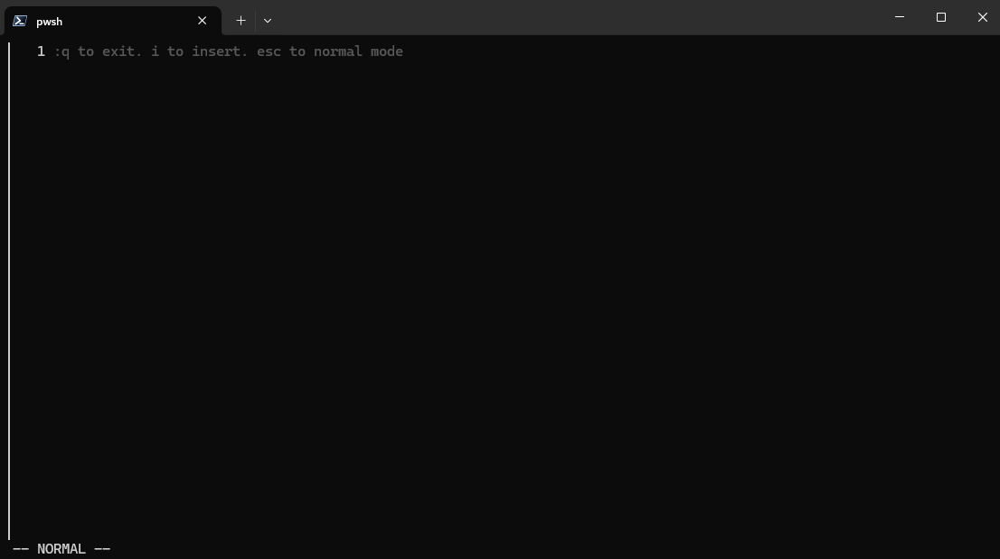
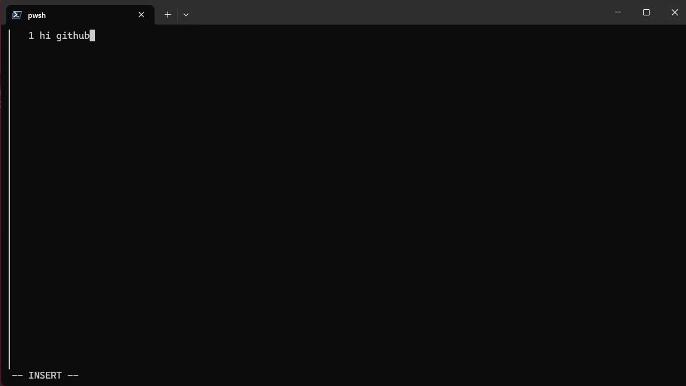
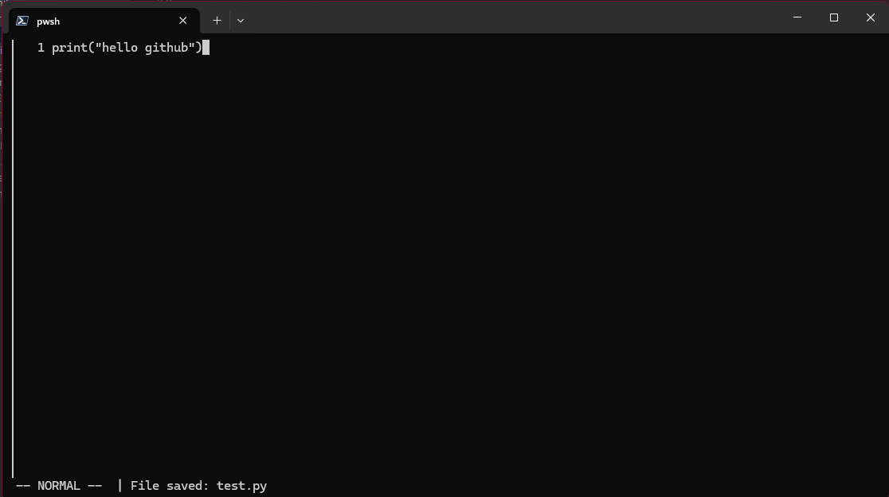

# 📌 Godit – Vim-like terminal text editor in Go

🚀 A **lightweight vim inspired terminal text editor** built with **Go and BubbleTea**.

---

## **📸 Screenshots**
<div align="center">
  
  
  
</div>

---

## **📜 Features**
✅ INSERT mode for writing files  
✅ NORMAL mode for navigating with basic implementations of Vim motions  
✅ COMMAND mode for classic Vim commands like :w and :q

---

## **📂 Tech Stack**
- **Go**
- **BubbleTea**


---

## **📦 Installation & Setup**

### **🔹 Prerequisites**
Make sure you have:  
✅ [Golang](https://go.dev/dl/) installed  
✅ [Git](https://git-scm.com/) installed

---

### **🔹 Clone the Repository**
```bash
git clone https://github.com/matiasalek/Godit.git
cd godit
```

---

### **🔹 Build and run the application with the terminal**
Simply run:
```bash
go build main.go
go run .
```

This will:  
✅ Start **Godit** on the terminal  

---

## **📁 Project Structure**
```
godit/
│── internal              # Main directory
    │── init.go
    │── model.go
    │── update.go
    │── view.go
│── main.go               # Runnable application
│── README.md             # Project Documentation
```

---

## **📜 License**
This project is **open-source** and available under the **MIT License**.


---

🔥 **Enjoy editing files in the terminal!** 🚀